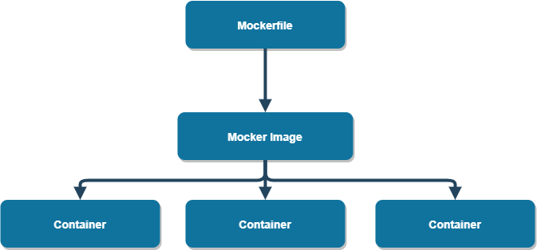

# Mocker for cost optimization

## 1. INTRODUCTION

Mocker is a software packaging platform that allows development teams to build, package, and deploy applications. It is a Platform-as-a-Service product and is open-source. Mocker containers can run on any cloud infrastructure, but the mocker administrator tools are optimized for Amazon cloud services. 

## 2. MOCKER INFRASTRUCTURE

**Mockerfile:** A text file defining the location of the resources needed by the Mocker container. Mockerfile defines Mocker Image.\
**Mocker Image:** It is defined by the Mocker file and is used to create Mocker containers. It can be run in parallel in as many containers as necessary, depending on the cloud infrastructure under which it runs.\
**Mocker container:** A bundle of software, libraries and configuration files. They are based on templates called images. 

## 3. ADMINISTRATION TOOLS 

 3.1. Charges specification
- Customers pay for access to support and administrator tools, however charges are based only on the number of Mocker containers that are being run at a given point in time. 
- Mocker containers can run on any cloud infrastructure, but the mocker administrator tools are optimized for Amazon cloud services. 

3.2 How administration tools help in optimizing costs: 
- they enable rapid deployment of Mocker containers without the need of additional scripting 
- there is no need to create scripts to control the Mocker daemon and handle the initialization and shutdown of containers
- Amazon and the Mocker foundation offer extensive documentation for developers not familiar with Amazon web services

